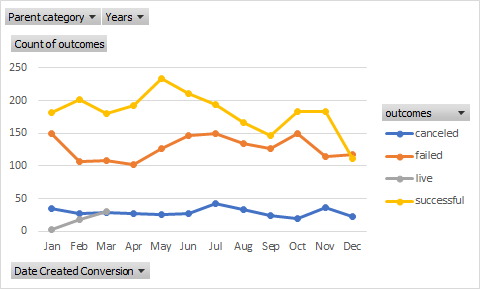

# An Analysis of Kickstarter Campaigns

Performing analysis on Kickstarter data to uncover trends.
A recomendation will made for someone in Great Britain looking to run a kicksarter for a play with a goal of $10,000 using the found trends.

## Overall Kickstarter Trends

The following trends were found when analyzing the kickstarter data.
* It was found that the theater catagory has the most kickstarter campaigns
* Theater campaigns were most sucsessful when launched in the May to July timeframe

The above points are supported by the following charts.

## Analysis of the Plays Subcatagory in Great Britain 

The plays subcategory has a more sucsessful then failed campaigns. 

By using a box plot (shown below) the following points of interest were found.

## Conclusion

$10,000 is a very high goal to set for a play in Great Britain and will almost certainly fail. The highest amount pleged for a play campaign was $10,092 with the value of 1.5*IQR at $3015. The ideal campaign would launch around May with a goal below $3015.
