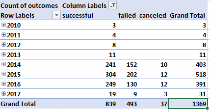
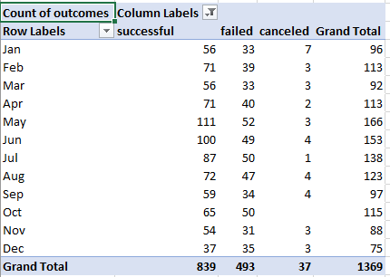
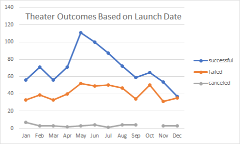
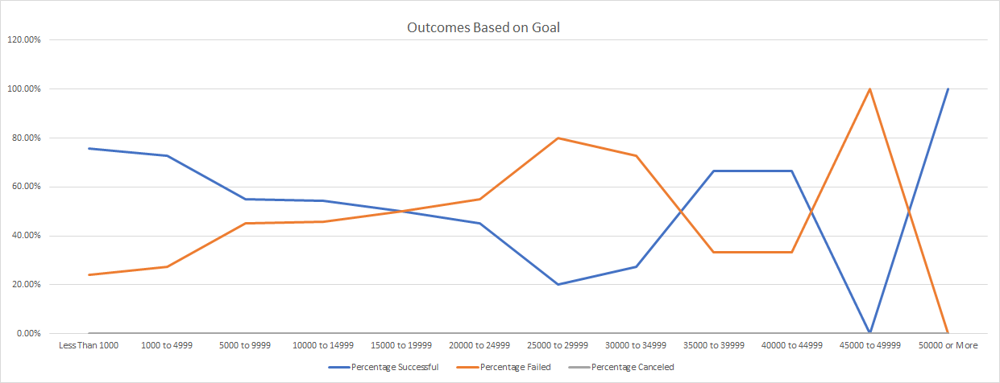

# Kickstarting with Excel

## Overview of Project
 
### Purpose

The purpose of the analysis is to find trends in the Kickstarter data.

## Analysis and Challenges

### Analysis of Outcomes Based on Launch Date

In order to create a chart of Outcomes Based on Launch Date I first made a pivot table of the source data. The pivot table fields were then set. It is important to note the "Years" and "Quarters" fields automatically generated in "Rows" area. If they are not removed the following table will be generated.

Once the fields are removed and the columns are sorted and the "live" data is filtered out the table will appear as shown in the following image.

A pivot chart can now be generated and can be viewed below.

### Analysis of Outcomes Based on Goals

In order to create a chart of Outcomes Based on Goals I first ensured I had a working `COUNTIFS()` formula in cell `B2`. The formula was then adapted to fit the context the remaining cells in the `B2:E13` range. To find the number of total projects in a given range the function `SUM()` was used to sum the number of successful, failed and canceled projects. Percentage of successful, failed and canceled projects was calculated used the `IFERROR()` function to avoid any divide by 0 errors. A chart was then created and can be seen below.

### Challenges and Difficulties Encountered

The most difficult portion of generating the Outcomes Based on Launch Date chart is understanding how to make the pivot table only show months. In order to do this one need to delete the automatically generated "years" and "Quarters" fields in "Rows".

The main difficulty when generating the Outcomes Based on Goals chart is manually changing each formula. Something I could have done to make this process quicker was store the upper and lower bounds in their own respective cells. This would allow me to code the formula to cells and then "double click" to apply the formula to the entire table. 

## Results

- What are two conclusions you can draw about the Outcomes based on Launch Date?

Two conclusions I can draw about the outcomes based on launch date are may has the most successful campaigns and December has the least number of successful campaigns.

- What can you conclude about the Outcomes based on Goals?

The conclusion I can draw from the outcomes based on Goals is goals less than 1000 have the highest chance of success. Even though the 50000 or more category has 100% of its campaign’s successfully funded it only has a sample size of 1 making it an unreliable statistic. 

- What are some limitations of this dataset?

I believe a limitation of this data set is the individual donations are not represented. This information would be useful to see if the importance of ether having multiple backers or one backer willing to make a large single donation.

- What are some other possible tables and/or graphs that we could create?

Creating a graph of year vs average donation would be useful to see how activity is trending over time.
